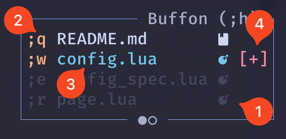

# Buffon


<div align="center">
    
</div>


*Buffon* is yet another plugin for navigating between buffers in [Neovim](https://neovim.io/). The name *Buffon* comes from the combination of *Buffer* and *Navigation*, creating the amusing word *buffon*, referencing the medieval jester who entertained the king.

This plugin is inspired by [harpoon](https://github.com/ThePrimeagen/harpoon) and [tide](https://github.com/jackMort/tide.nvim). Both are fantastic, but they didn't quite fit my workflow.

Things I like and dislike about these plugins:

**Harpoon**

| `Likes`               | `Dislikes` |
|----                  |----       |
| * Data persistence    | * Having to select which buffers to work with |
| * Buffers can be sorted | * Constantly having to open and close the window to see which buffers are selected, change the order, delete them, etc. |
| * Good API | |
| * Tests | |

**Tide**

| `Likes`               | `Dislikes` |
|----                  |----       |
| * Pleasant and beautiful interface | * Having to select which buffers to work with |
| * Shortcuts to access a buffer directly | * Buffers cannot be sorted |
| * Always having the buffer list visible | * No persistence |

Based on this, I created *Buffon* with the best of both plugins, perfectly adapting to my way of working.

## What Buffon offers

* Simple and minimalist interface
* Always visible interface
* Data persistence, storing the cursor position
* Works with **all** open buffers
* Buffers can be:
  * Sorted: Move one position up/down, send to the beginning or end of the list
  * Closed: You can close one buffer, all, those above, those below, or the "others"
  * Navigate between previous and next buffer
  * Access a specific buffer
  * Toggle between the last used buffer
  * Reopen closed buffer
  * Shows modified buffer indicator
  * Organize buffers into pages
* Help window to see the shortcuts

> [!NOTE]
> If you like all these features and the plugin also adapts to your needs, I would greatly appreciate it if you **click on the star**.

## Installation

> [!NOTE]
> require neovim 0.10.0+

### Using [lazy](https://github.com/folke/lazy.nvim):

```lua
return {
  {
    "francescarpi/buffon.nvim",
    branch = "main",
    ---@type BuffonConfig
    opts = {
      --- Add your config here
    },
    dependencies = {
      "nvim-tree/nvim-web-devicons",
      "nvim-lua/plenary.nvim",
    },
  },
}
```

## Default Configuration

Below you can see the default configuration, which you can adjust to your liking in the setup. For example:

```lua
return {
  {
    "francescarpi/buffon.nvim",
    branch = "main",
    ---@type BuffonConfig
    opts = {
      cyclic_navigation = true,
    },
    dependencies = {
      "nvim-tree/nvim-web-devicons",
      "nvim-lua/plenary.nvim",
    },
  },
}
```

Default configuration:

Take a look at the default shortcuts for navigating between buffers, changing their order, or closing them:


```lua
{
  cyclic_navigation = true,
  --- possible values:
  ---   "start": buffers are added at the begginning of the buffers list
  ---   "end": buffers are added at the end of the list
  ---   "after": are added after the active buffer
  new_buffer_position = "end",
  num_pages = 2,
  open = {
    by_default = true,
    offset = {
      x = 0,
      y = 0,
    },
    ignore_ft = {
      "gitcommit",
      "gitrebase",
    },
  },
  --- Buffers that should be ignored by buffon
  --- It accepts a list of regex patterns
  ignore_buff_names = {
    "diffpanel_",
  },
  theme = {
    unloaded_buffer = "#404040",
    shortcut = "#CC7832",
    active = "#51afef",
    unsaved_indicator = "#f70067",
  },
  leader_key = ";",
  mapping_chars = "qweryuiop",
  keybindings = {
    goto_next_buffer = "<s-j>",
    goto_previous_buffer = "<s-k>",
    move_buffer_up = "<s-l>",
    move_buffer_down = "<s-h>",
    move_buffer_top = "<s-t>",
    move_buffer_bottom = "<s-b>",
    toggle_buffon_window = "<buffonleader>n",
    --- Toggle window position allows moving the main window position
    --- between top-right and bottom-right positions
    toggle_buffon_window_position = "<buffonleader>nn",
    switch_previous_used_buffer = "<buffonleader><buffonleader>",
    close_buffer = "<buffonleader>d",
    close_buffers_above = "<buffonleader>v",
    close_buffers_below = "<buffonleader>b",
    close_all_buffers = "<buffonleader>cc",
    close_others = "<buffonleader>cd",
    reopen_recent_closed_buffer = "<buffonleader>t",
    show_help = "<buffonleader>h",
    previous_page = "<buffonleader>z",
    next_page = "<buffonleader>x",
    move_to_previous_page = "<buffonleader>a",
    move_to_next_page = "<buffonleader>s",
  },
}
```
> [!TIP]
> If you use `nvim-lspconfig`, the `s-k` shortcut (goto previous) may collide with the `lsp` one to view the documentation. In my case, I have this shortcut remapped to:
>
> ```lua
> vim.keymap.set("n", "c-l", vim.lsp.buf.hover)
> ````

### Disable keybindings

The keybindings shown in the following list can be deactivated. The reason for this is that some people may not be interested in using the functionality to close buffers, move them, etc.

```lua
{
  goto_next_buffer,
  goto_previous_buffer,
  move_buffer_up,
  move_buffer_down,
  move_buffer_top,
  move_buffer_bottom,
  switch_previous_used_buffer,
  close_buffer,
  close_buffers_above,
  close_buffers_below,
  close_all_buffers,
  close_others,
  reopen_recent_closed_buffer,
}
```

To do this, you only have to assign the string "false" or leave it blank in the configuration. For example:


```lua
{
  opts = {
    keybindings = {
      close_buffer = "false"
      close_others = ""
    },
  },
}
```

### Theming

The interface colors can be customized to your liking. There are four elements that can be personalized:

1. Unloaded buffers (BuffonUnloadedBuffer)
2. Shortcut (BuffonShortcut)
3. Active buffers (BuffonActive)
4. Modified buffer indicator (BuffonUnsavedIndicator)

<div align="left">
    
</div>


> [!NOTE]
> The names of the Neovim highlight groups are indicated in parentheses.

There are two ways to customize the colors:

1) Use Neovim's API to change the colors. For example:

```lua
vim.api.nvim_set_hl(0, "BuffonUnloadedBuffer", { fg = "#404040" })
```

2) Use Buffon's own configuration. In the `theme` node, you can specify the different colors for each group.

> [!NOTE]
> If a highlight group exists in Neovim, it will take precendence over the one specified in Buffon's configuration. Therefore, if you want to change the color of a highlight group, you must first remove it with `vim.api.nvim_set_hl(0, "BuffonUnloadedBuffer", { fg = nil })` and then specify the new color. This is because if a colorscheme is installed that has a defined highlight group, it will take precedence over the one specified in Buffon's configuration.

## Screenshots

Buffon window, showing the buffer list:


Showing the help window:


## Extensions

> [!NOTE]
> You can view all available extensions [here](/extensions.md)

You can build extensions for Buffon by using the `require("buffon").add()` function. The function expects a callback function which has the [maincontroller](/lua/buffon/maincontroller.lua) as its first parameter. This way you can manipulate Buffon in whichever way you want:

```lua
require("buffon").add(function (maincontroller)
  vim.notify(vim.inspect(maincontroller.config))
end)
```

This also allows you to make plugins which other people can use too, by simply adding them to their config:

```lua
return {
  "plugin-author/plugin-repo",
  opts = {},
  ...
}
```

The plugin might have following structure:

```lua
local M = {}
local config = {}

---@type BuffonPluginFunc add this for better completion
local function initialize_plugin(maincontroller)
  if config.remap["x"] then
    maincontroller.config.mapping_chars["x"] = "z"
  else
    maincontroller.config.mapping_chars = ""
  end
end

function M.setup(opts)
  config = opts
  require("buffon").add(initialize_plugin)
end

return M
```

The function will be executed as soon as Buffon is fully set up.

> If you've built an extension, feel free to add it to the [extensions](/extensions.md) file!

## API

All the code has been developed using objects (OOP), facilitating maintenance, debugging, and readability. In the [Project Structure](./?tab=readme-ov-file#project-structure) section, the functionality of each file is detailed. If you want to start analyzing the code, start with `init.lua`, which is where the plugin is configured and the different objects are instantiated, and continue with `maincontroller.lua`, which is responsible for orchestrating user actions and neovim events with the plugin logic.

## Contribution

You are welcome to propose improvements, report bugs, or send pull requests. Keep in mind that for a PR to be accepted, it must pass the various CI checks, such as tests or the linter.

To run the tests locally, it is necessary to follow these steps:

```bash
cd buffon.nvim
mkdir packages
git clone https://github.com/nvim-lua/plenary.nvim.git packages/plenary.nvim
git clone https://github.com/nvim-tree/nvim-web-devicons.git packages/nvim-web-devicons
make test
```

### Project Structure

I have tried to organize the code in the best way I knew how, although it can surely be improved. Below I explain how it is structured:

* buffer.lua: Buffer object, where the properties of each buffer shown in the list are stored.
* bufferslist.lua: Manages the buffer list
* config.lua: Manages the configuration
* init.lua: Configures and starts the plugin.
* log.lua: Manages the logs (uses [plenary](https://github.com/nvim-lua/plenary.nvim))
* maincontroller.lua: Orchestrates user actions and events with the plugin logic
* page.lua: Manages a page
* pagecontroller.lua: Manages all pages
* storage.lua: Manages data persistence
* ui
  * mainwindow.lua: Buffon's main window
  * help.lua: Help window
  * window.lua: Object to display windows
* utils.lua: Various utilities

The `tests` folder includes the entire battery of tests for the plugin.

### Development branch

The integration branch will always be **develop**. All pull requests should be directed to this branch. When the code is stable, the repository owner will merge the changes from *develop* to *main* to release a new version.

> [!NOTE]
> I don't know the impact this plugin will have, but if it grows a lot or there is a lot of movement, I will be unable to maintain it and will need help from one or two maintainers.

**I hope you like it and enjoy it!**

